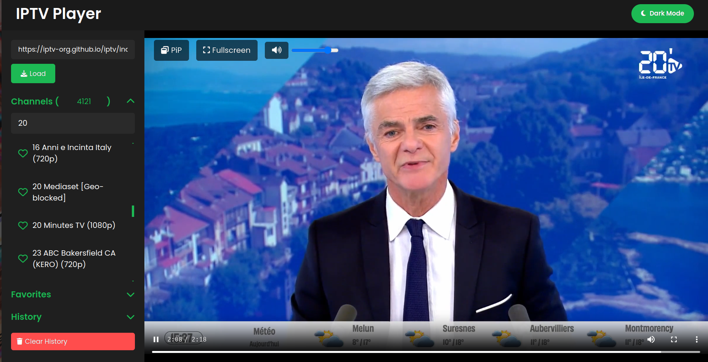

# IPTV Player

A modern IPTV player built with **TypeScript**, **Sass**, **HLS.js**, **Babel**, and **Webpack**.

Additionally, you can use the IPTV playlist from the following source: https://iptv-org.github.io/iptv/index.m3u. This playlist provides a vast collection of IPTV channels from around the world, which you can easily integrate into your IPTV Player application.

## DEMO

https://www.othmaneblial.xyz/iptv



## Features

- **Channel Playback**: Load M3U/M3U8 playlists, filter and play channels with HLS support.
- **Favorite Channels**: Save, view, and manage favorite channels.
- **History Tracking**: Automatically tracks viewed channels with timestamped history.
- **Theme Toggle**: Switch between dark and light modes.
- **Customizable UI**: Built with flexible Sass variables and mixins.

## Getting Started

### Prerequisites

- **Node.js** and **npm**

### Installation

1. **Clone the Repository**:

   ```bash
   git clone https://github.com/your-username/iptv-player.git
   cd iptv-player
   ```

2. **Install Dependencies**:
   ```bash
   npm install
   ```

### Usage

1. **Run in Development Mode**:

   ```bash
   npm start
   ```

   Opens the IPTV Player in your default browser at `localhost:8080`.

2. **Build for Production**:
   ```bash
   npm run build
   ```
   Creates a production-ready build in the `dist` folder.

## Project Structure

- **src/**: Source code
  - **components/**: Reusable UI components (`Header`, `Sidebar`, `Player`)
  - **utils/**: Utilities (`favorites`, `history`, `playlist`, `theme`)
  - **styles/**: Sass styles (`_variables.scss`, `_mixins.scss`)
  - **index.ts**: Main entry point

## Scripts

- **npm start**: Launches the development server.
- **npm run build**: Builds the project for production.
- **npm run lint**: Lints TypeScript files.
- **npm run format**: Formats code with Prettier.

## Dependencies

- **hls.js**: For HLS video playback.
- **Webpack**: Bundles modules, handles assets.
- **TypeScript**: Adds static typing.
- **Sass**: Styles with flexibility.

## License

This project is licensed under the MIT License.
