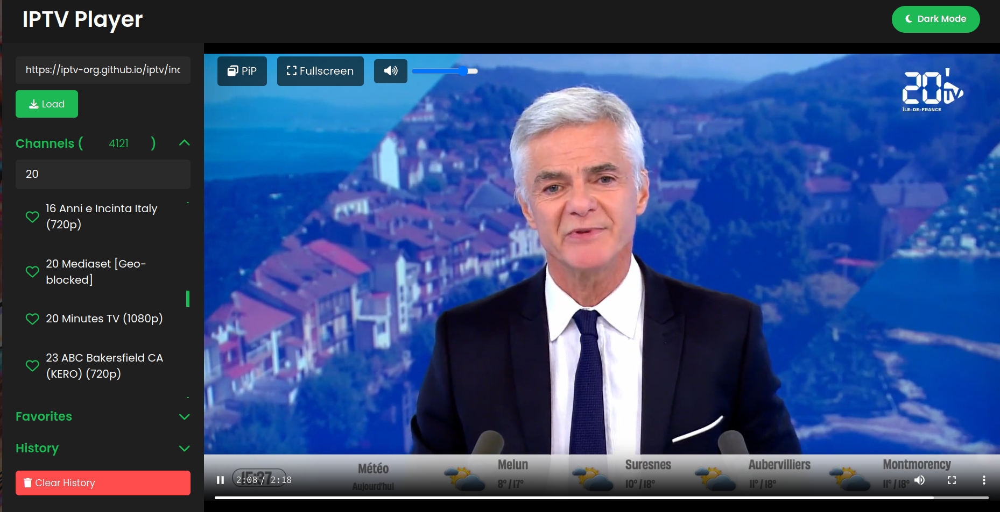

# Broadcast Console

Broadcast Console is a polished IPTV workspace for loading playlists, watching HLS streams, managing favorites and history, importing guide data, validating source health, and building a more personalized viewing setup with profiles and multiview.

It started as a small IPTV player and is now closer to a real product:

- multi-playlist library with backup import/export
- fuzzy channel discovery with country, language, group, favorite, recent, and health-aware sorting
- HLS playback with retries, quality selection, audio-track selection, and diagnostics
- favorites, pinned channels, watch history, and resume flow
- XMLTV EPG import with now/next guide surfaces
- source health checks and manual stream reporting
- profile-aware restrictions with parental unlock
- quick-switch, mini-player, and multiview previews
- installable PWA, optional cloud sync, CI, and Docker deployment

## Preview



## Quick Start

### Requirements

- Node.js 20+ recommended
- npm

### Install

```bash
git clone https://github.com/OthmaneBlial/iptv-player.git
cd iptv-player
npm ci
```

### Start The App

```bash
npm start
```

Webpack Dev Server will build the app, launch the development server, and pick an available local port automatically. It will usually open your browser by itself.

If it does not open by itself, go to:

```text
check the terminal output for the exact local URL
```

If you want to force a specific port, run:

```bash
PORT=8081 npm start
```

### Load A Playlist

After the app opens:

1. Paste a playlist URL into the `Playlist URL` field.
2. Or import a local `.m3u` / `.m3u8` file.
3. Or paste raw playlist content directly.

If you just want a quick public sample, try:

```text
https://iptv-org.github.io/iptv/index.m3u
```

## How To Run This Project

### Development Mode

Use this while building features:

```bash
npm start
```

What this does:

- starts the webpack dev server
- rebuilds when files change
- serves the app locally for testing
- uses a free port automatically unless you set `PORT` yourself

### Run Tests

```bash
npm test -- --runInBand
```

This runs the Jest suite for store, playlist parsing, storage, and app startup behavior.

### Production Build

```bash
npm run build
```

This creates the production bundle in `dist/`.

### Run With Docker

```bash
docker build -t broadcast-console .
docker run --rm -p 8080:80 broadcast-console
```

Then open:

```text
http://localhost:8080
```

## Feature Overview

### Playlist And Discovery

- import playlists from URL, file, or raw text
- save multiple playlists and switch between them
- rename, duplicate, delete, export, and restore playlist libraries
- browse by group, country, language, recent, favorites, or source health

### Playback And Viewing

- HLS.js-based playback with retry handling
- quality and audio-track controls
- picture-in-picture and fullscreen support
- mini-player layout for quick switching
- multiview preview wall for 2-up or 4-up watching

### Collections And Guide

- favorites and pinned shortcuts
- history with quick replay
- resume last watched channel
- XMLTV import for now/next and schedule context

### Source Quality And Support

- source health scan for active playlists
- manual “works” and “issue” reporting
- diagnostics export for troubleshooting
- playback and runtime error logging

### Personalization

- built-in profiles
- profile-aware blocked groups
- PIN-based unlock for restricted groups
- personalized “For You” recommendations
- quick-switch suggestions built from current, recent, and favorite channels

### Install And Sync

- installable PWA flow
- optional GitHub Gist cloud sync
- Docker deployment
- GitHub Actions CI

## Profiles And Default PINs

The app currently ships with three default local profiles:

- `Owner`
- `Family`
- `Kids`

Default PINs:

- `Family`: `2468`
- `Kids`: `1234`

These are local defaults meant for development and demo usage. If you want different values, update the profile defaults in [`src/utils/profileDefaults.ts`](/home/othmane/Downloads/iptv-player/src/utils/profileDefaults.ts).

## Scripts

```bash
npm start        # start webpack dev server
npm run build    # create production bundle
npm test         # run Jest
npm run lint     # run ESLint
npm run format   # run Prettier
```

## Project Structure

```text
src/
  components/    UI building blocks
  services/      player, header, multiview, bootstrap services
  store/         central application state
  styles/        Sass design system and component styles
  utils/         playlist, favorites, history, EPG, sync, source health, profiles
  workers/       playlist parsing worker
docs/
  deployment.md  deployment notes
```

## Deployment

For deployment details, read [`docs/deployment.md`](/home/othmane/Downloads/iptv-player/docs/deployment.md).

Typical paths:

- static hosting from `dist/`
- Docker with Nginx
- installable PWA

## Notes

- Stream availability depends on the playlist source. Some channels may go offline or change without notice.
- Browser CORS behavior can affect some remote playlist or stream checks.
- Source health is best-effort and combines lightweight checks with real playback signals and manual feedback.
- The production build currently emits webpack bundle-size warnings, but it builds successfully.

## License

ISC
